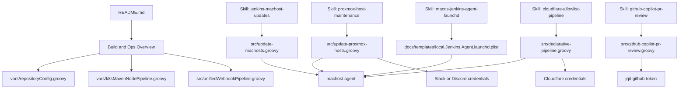

# Jenkins Shared Library

Jenkins 用の共有ライブラリとパイプライン定義を提供するプロジェクトです。Kubernetes 環境での Maven+Node ビルド、GitHub Webhook による自動ビルド、Cloudflare WAF の自動管理、IMAP メール監視からの Slack 通知を含みます。

## 🎯 主な特徴

- **📦 設定の一元管理**: `repositoryConfig.groovy`で全てのリポジトリ設定を管理
- **🔄 GitHub Webhook対応**: リポジトリを自動検出して適切な設定でビルド
- **⚙️ パラメータ削減**: 必要なパラメータを最大90%削減
- **☸️ Kubernetes対応**: Pod-based agentでビルドを実行
- **🔍 SonarQube統合**: コード品質分析を自動化
- **📬 メール監視通知**: IMAP メールボックスを定期監視し、条件一致メールを Slack へ通知

## 目次

- [機能](#機能)
- [プロジェクト構成](#プロジェクト構成)
- [SKILL対応マップ](#skill対応マップ)
- [クイックスタート](#クイックスタート)
- [前提条件](#前提条件)
- [セットアップ](#セットアップ)
- [使用方法](#使用方法)
  - [GitHub Webhook パイプライン](#github-webhook-パイプライン)
  - [従来型パイプライン](#従来型パイプライン)
- [設定管理](#設定管理)
- [詳細ドキュメント](#詳細ドキュメント)
- [トラブルシューティング](#トラブルシューティング)
- [変更履歴](#変更履歴)

## 機能

### 1. 🔄 GitHub Webhook による統合ビルドパイプライン

- **リポジトリ自動検出**: Webhookから送られたリポジトリURLを自動解析
- **設定自動適用**: `repositoryConfig.groovy`から適切な設定を自動取得
- **認証情報自動切り替え**: リポジトリごとに異なるSSH鍵を自動選択
- **複数ビルドプロファイル対応**: dev, local, prod など柔軟に対応

### 2. 📦 リポジトリ設定の一元管理

- **単一ファイルで管理**: 全てのリポジトリ設定を`vars/repositoryConfig.groovy`で管理
- **設定項目**:
  - 🔐 認証情報ID
  - 🏗️ ビルドプロファイル
  - 📦 アーカイブパターン
  - 🔍 SonarQube設定
  - ☸️ Kubernetes リソース要件

### 3. ☸️ Kubernetes 上での Maven+Node ビルド

- Kubernetes Pod 上で Maven ビルドを実行
- リソース要件を設定ごとにカスタマイズ可能
- 自動スケーリングとクリーンアップ

### 4. 🛡️ Cloudflare IP Allowlist 自動更新

- Jenkins サーバーのグローバル IP を定期的に取得
- IP 変更時に自動的に Cloudflare WAF ルールを更新
- 前回 IP と現在 IP の両方を許可リストに保持

### 5. 🔧 再利用可能なヘルパー関数

- **gitCloneSsh**: SSH認証でGitクローン（認証情報自動取得対応）
- **k8sPodYaml**: Kubernetes Pod定義の動的生成（設定自動取得対応）
- **authenticatedCheckout**: 認証情報を自動解決してチェックアウト
- **repositoryConfig**: リポジトリ設定の一元管理

### 6. 🖥️ Proxmox ホスト監視/更新パイプライン

- **update-proxmox-hosts**: Proxmox ホスト専用の監視/更新パイプライン
- デフォルトでは更新候補の検知のみを実施
- `TEST_NOTIFICATIONS_ONLY=true` の場合は通知テストのみを実施
- `APPLY_UPDATES=true` の場合のみ `full-upgrade` を実行
- クラスタ構成時は quorum を確認してから更新を実行
- 検知結果は `proxmox-host-results.json` としてアーティファクト保存
- `slack-webhook-url` または `discord-webhook-url` を Jenkins Credentials の Secret text として登録すると通知を送信
- 通知には Jenkins ジョブ URL と結果JSONへのリンクを含める

### 7. 📬 IMAP メール監視パイプライン

- **monitor-email-alerts**: Kubernetes コンテナ Agent 上で IMAP メールボックスを定期監視
- 件名 / 宛先 / 送信元 / 本文 / 全文横断キーワードで一致判定
- 一致メールだけを Slack API `chat.postMessage` で通知
- `UID` ベースの state ファイルを保存して重複通知を防止
- `PVC_CLAIM_NAME` を指定すると Pod 再作成後も state を保持可能
- `TEST_NOTIFICATIONS_ONLY=true` で Slack 通知疎通のみ確認可能

### 8. 🤖 GitHub Copilot CLI による PR 自動レビュー

- **github-copilot-pr-review**: GitHub `pull_request` Webhook を受け取り PR を自動レビュー
- `@github/copilot` npm パッケージを使って差分を AI 解析
- レビュー結果を PR の通常コメントとして自動投稿
- Webhook ペイロードの `$.repository.full_name` でリポジトリを動的に判定（複数リポジトリ共有可）
- opened / synchronize / reopened イベントに反応し、不要なトリガーを除外

## プロジェクト構成

```
jenkins-cli/
├── README.md                                # このファイル
├── .gitignore                               # Git除外設定
│
├── docs/                                   # ドキュメント
│   ├── UNIFIED_WEBHOOK_SETUP.md            # 統合Webhookパイプラインのセットアップガイド
│   ├── REPOSITORY_CONFIG_GUIDE.md          # リポジトリ設定管理ガイド
│   ├── AUTHENTICATION_GUIDE.md              # 認証設定ガイド
│   ├── MAIL_MONITOR_PIPELINE.md            # IMAP メール監視パイプラインガイド
│   ├── OPERATIONS_OVERVIEW.md              # 運用系パイプラインの概要
│   ├── GITHUB_COPILOT_PR_REVIEW.md         # GitHub Copilot PR 自動レビュー詳細ガイド
│   └── templates/local.Jenkins.Agent.launchd.plist # machost用launchdテンプレート
│
├── src/                                     # パイプライン定義
│   ├── unifiedWebhookPipeline.groovy       # 統合Webhookパイプライン（直接実装版）
│   ├── portalAppPipeline.groovy            # Portal App ビルドパイプライン（簡略化済み）
│   ├── portalAppBackEndPipeline.groovy     # Portal App Backend ビルドパイプライン（簡略化済み）
│   ├── declarative-pipeline.groovy         # Cloudflare allowlist 更新パイプライン
│   ├── monitor-email-alerts.groovy         # IMAP メール監視 → Slack 通知パイプライン
│   ├── github-copilot-pr-review.groovy     # GitHub Copilot CLI による PR 自動レビューパイプライン
│   ├── update-machosts.groovy              # Debian/Ubuntu 系 machost 更新パイプライン
│   └── update-proxmox-hosts.groovy         # Proxmox ホスト監視/更新パイプライン
│
├── vars/                                    # Jenkins Shared Library 関数
│   ├── core/                                # 🔧 コア機能
│   │   ├── repositoryConfig.groovy         # ★ リポジトリ設定の一元管理
│   │   ├── unifiedWebhookPipeline.groovy   # 統合Webhookパイプライン（Shared Library版）
│   │   └── authenticatedCheckout.groovy     # 認証情報自動解決チェックアウト
│   │
│   ├── build/                               # 🔨 ビルド支援
│   │   └── k8sMavenNodePipeline.groovy     # K8s上でMaven+Nodeビルド実行（設定自動取得対応）
│   │
│   ├── git/                                 # 🐙 Git操作
│   │   └── gitCloneSsh.groovy              # SSH経由でGitクローン（認証情報自動取得対応）
│   │
│   └── kubernetes/                          # ☸️ Kubernetes
│       └── k8sPodYaml.groovy               # Kubernetes Pod定義生成（設定自動取得対応）
```

### 重要なファイル

| ファイル                                    | 役割                | 説明                                 |
| ------------------------------------------- | ------------------- | ------------------------------------ |
| **vars/core/repositoryConfig.groovy**       | 🎯 設定の中心       | 全リポジトリの設定を一元管理         |
| **vars/core/unifiedWebhookPipeline.groovy** | 🔄 統合パイプライン | Webhook対応の統合ビルドパイプライン  |
| **vars/core/authenticatedCheckout.groovy**  | 🔐 認証管理         | 認証情報を自動解決してチェックアウト |
| **docs/UNIFIED_WEBHOOK_SETUP.md**           | 📖 セットアップ     | 詳細なセットアップ手順               |
| **docs/REPOSITORY_CONFIG_GUIDE.md**         | 📖 設定ガイド       | 設定管理の詳細ガイド                 |

## SKILL対応マップ

GitHub Copilot 向けの SKILL と、実際に参照すべき主要ファイルの対応は次の通りです。



- build 系の入口は `README.md`、`vars/repositoryConfig.groovy`、`vars/k8sMavenNodePipeline.groovy`、`src/unifiedWebhookPipeline.groovy`
- 運用系の入口は `src/update-machosts.groovy`、`src/update-proxmox-hosts.groovy`、`src/declarative-pipeline.groovy`、`src/monitor-email-alerts.groovy`
- PR 自動レビューの入口は `src/github-copilot-pr-review.groovy`
- macOS 上の Jenkins agent 常駐設定は `docs/templates/local.Jenkins.Agent.launchd.plist` を参照
  - 現在のテンプレートは Jenkins agent 用 Java 21 前提

## クイックスタート

### 🚀 最もシンプルな使い方

#### 1. リポジトリ設定を追加

`vars/core/repositoryConfig.groovy` に設定を追加：

```groovy
'YourRepo': [
  credentialsId: 'YOUR_CREDENTIALS_ID',
  buildProfiles: ['dev', 'prod'],
  archivePattern: '**/target/*.jar',
  sonarProjectName: 'YourRepo',
  sonarEnabled: true
]
```

#### 2. パイプラインを作成

たった2行でビルドパイプラインが完成：

```groovy
@Library('jqit-lib@main') _

k8sMavenNodePipeline(
  gitRepoUrl: 'git@github.com:your-org/YourRepo.git'
  // 全ての設定は vars/core/repositoryConfig から自動取得！
)
```

#### 3. GitHub Webhookで自動ビルド

統合Webhookパイプラインを使用すれば、複数リポジトリを1つのパイプラインで処理：

```groovy
@Library('jqit-lib@main') _

unifiedWebhookPipeline()
// Webhookからリポジトリを自動検出し、適切な設定で自動ビルド！
```

詳細は [UNIFIED_WEBHOOK_SETUP.md](docs/UNIFIED_WEBHOOK_SETUP.md) を参照してください。

## 前提条件

### Jenkins 環境

**必須バージョン:**

- Jenkins 2.x 以上（推奨: 2.400+）

**必須プラグイン:**

以下のプラグインがインストールされている必要があります：

| プラグイン名        | ID                  | 説明                           | 必須理由                           |
| ------------------- | ------------------- | ------------------------------ | ---------------------------------- |
| Pipeline            | workflow-aggregator | パイプライン機能の基本         | Declarative/Scripted Pipeline 実行 |
| Git                 | git                 | Git リポジトリとの連携         | ソースコード管理                   |
| SSH Agent           | ssh-agent           | SSH 認証の管理                 | GitHub SSH 接続                    |
| Kubernetes          | kubernetes          | Kubernetes 上でビルド実行      | K8s Pod エージェント起動           |
| Credentials Binding | credentials-binding | 認証情報のバインディング       | パイプラインでの認証情報使用       |
| Workspace Cleanup   | ws-cleanup          | ワークスペースのクリーンアップ | `cleanWs()` メソッド使用           |
| Timestamper         | timestamper         | ログにタイムスタンプ追加       | デバッグ用（オプション）           |

**プラグインのインストール方法:**

1. **Manage Jenkins** → **Manage Plugins** → **Available plugins**
2. 上記プラグインを検索してチェック
3. **Install without restart**（または**Download now and install after restart**）をクリック

または、Jenkins CLI でインストール：

```bash
# Jenkins CLI を使用したプラグインインストール
jenkins-cli install-plugin workflow-aggregator git ssh-agent kubernetes credentials-binding ws-cleanup timestamper
```

### Kubernetes 環境

- 利用可能な Kubernetes クラスター
- Jenkins からアクセス可能な Namespace
- Docker Hub へのアクセス（カスタムイメージ使用時）

### 認証情報

以下の認証情報を Jenkins に登録する必要があります：

<!-- markdownlint-disable MD060 -->

| ID                        | 種別                          | 登録先     | 説明                       | 使用箇所                 |
| ------------------------- | ----------------------------- | ---------- | -------------------------- | ------------------------ |
| `JQIT_ONO`                | SSH Username with private key | Jenkins    | GitHub SSH 認証鍵          | repositoryConfig で設定  |
| `dockerhub-jenkins-agent` | docker-registry Secret        | Kubernetes | Docker Hub imagePullSecret | k8sPodYaml               |
| `sonarQubeCredId`         | Secret text                   | Jenkins    | SonarQube認証トークン      | k8sMavenNodePipeline     |
| `CF_API_TOKEN`            | Secret text                   | Jenkins    | Cloudflare API トークン    | declarative-pipeline     |
| `CF_ZONE_ID`              | Secret text                   | Jenkins    | Cloudflare ゾーン ID       | declarative-pipeline     |
| `jqit-github-token`       | Secret text                   | Jenkins    | GitHub PAT（Copilot CLI 認証用、Fine-grained PAT 推奨。Repository permissions: `Pull requests: Read` / `Contents: Read` / `Copilot Requests` 程度の最小権限を付与する） | github-copilot-pr-review |

<!-- markdownlint-enable MD060 -->

**注意**: 認証情報IDは `vars/repositoryConfig.groovy` で設定できます。

## セットアップ

### 1. Shared Library として登録

Jenkins 管理画面で以下の設定を行います：

1. **Manage Jenkins** → **Configure System** → **Global Pipeline Libraries**
2. 以下の情報を入力：
   - **Name**: `jqit-lib`（任意の名前、パイプラインで`@Library`に使用）
   - **Default version**: `main`（使用するブランチ）
   - **Retrieval method**: **Modern SCM**
   - **Source Code Management**: **Git**
   - **Project Repository**: `https://github.com/YukiOno-1015/jenkins-cli.git`
   - **Credentials**: （プライベートリポジトリの場合のみ必要）
3. **Save**をクリック

### 2. Kubernetes 環境の準備

#### 2.1 Namespace の作成（未作成の場合）

```bash
kubectl create namespace jenkins
```

#### 2.2 Docker Hub imagePullSecret の作成

プライベートイメージを使用する場合のみ必要です：

```bash
# Docker Hub の認証情報を使ってKubernetesシークレットを作成
kubectl create secret docker-registry dockerhub-jenkins-agent \
  --docker-server=https://index.docker.io/v1/ \
  --docker-username=<your-dockerhub-username> \
  --docker-password=<your-dockerhub-password> \
  --docker-email=<your-email> \
  --namespace=jenkins

# 作成確認
kubectl get secret dockerhub-jenkins-agent -n jenkins
```

**注意**: パブリックイメージのみ使用する場合、この手順はスキップできます。

#### 2.3 Jenkins Kubernetes Cloud 設定

1. **Manage Jenkins** → **Configure System** → **Cloud**
2. **Add a new cloud** → **Kubernetes**
3. 以下を設定：
   - **Name**: `kubernetes`
   - **Kubernetes URL**: Kubernetes クラスタのエンドポイント（空欄で自動検出）
   - **Kubernetes Namespace**: `jenkins`
   - **Credentials**: Kubernetes への接続に必要な場合のみ
   - **Jenkins URL**: Jenkins 自身の URL（例: `http://jenkins-svc:8080`）
   - **Jenkins tunnel**: （オプション）JNLP 接続用
4. **Test Connection**で接続を確認
5. **Save**をクリック

### 3. 認証情報の登録

#### 3.1 GitHub SSH 認証鍵

```
Manage Jenkins → Manage Credentials → Add Credentials
- Kind: SSH Username with private key
- ID: github-ssh
- Username: git
- Private Key: （GitHub用の秘密鍵を入力）
```

**Docker Hub imagePullSecret:**

```bash
# 1. Docker Hub の認証情報を使ってKubernetesシークレットを作成
kubectl create secret docker-registry dockerhub-jenkins-agent \
  --docker-server=https://index.docker.io/v1/ \
  --docker-username=<your-dockerhub-username> \
  --docker-password=<your-dockerhub-password> \
  --docker-email=<your-email> \
  --namespace=jenkins

# 2. シークレットが作成されたことを確認
kubectl get secret dockerhub-jenkins-agent -n jenkins

# 注意: プライベートイメージを使用しない場合、この設定は不要です
# パブリックイメージのみ使用する場合は、k8sPodYamlのimagePullSecretパラメータを空文字列に設定できます
```

**Cloudflare 認証情報:**

```
Manage Jenkins → Manage Credentials → Add Credentials
- Kind: Secret text
- Secret: （各値を入力）
- ID: CF_API_TOKEN / CF_ZONE_ID
```

## 使用方法

### GitHub Webhook パイプライン

GitHub Webhookから複数リポジトリのビルドを自動化します。

#### Shared Library版（推奨）

```groovy
@Library('jqit-lib@main') _

unifiedWebhookPipeline()
```

これだけで以下が自動的に行われます：

- ✅ Webhookからリポジトリ情報を自動抽出
- ✅ `repositoryConfig.groovy`から設定を自動取得
- ✅ 適切な認証情報で自動チェックアウト
- ✅ ビルドプロファイルに応じたビルド実行
- ✅ SonarQube解析（有効な場合）
- ✅ 成果物のアーカイブ

詳細は **[UNIFIED_WEBHOOK_SETUP.md](UNIFIED_WEBHOOK_SETUP.md)** を参照。

### GitHub Copilot による PR 自動レビュー

GitHub の Pull Request を契機に、`src/github-copilot-pr-review.groovy` が GitHub Copilot CLI (`@github/copilot`) を呼び出して差分をレビューし、その結果を PR の通常コメントとして自動投稿します（GitHub 標準の「Copilot Code Review」機能を呼び出すものではありません）。

最小セットアップとしては、Jenkins に対象ジョブを登録し、レビュー対象リポジトリの Webhook を設定してください。

Webhook の具体的な設定値、イベント条件、動作フロー、必要な Credential、運用上の注意点などの詳細は **[docs/GITHUB_COPILOT_PR_REVIEW.md](docs/GITHUB_COPILOT_PR_REVIEW.md)** を参照してください。

### 従来型パイプライン

#### k8sMavenNodePipeline

Kubernetes 上で Maven ビルドを実行します。**repositoryConfigから設定を自動取得するため、パラメータは最小限でOK！**

```groovy
@Library('jqit-lib@main') _

// 最小構成: gitRepoUrlだけでOK
k8sMavenNodePipeline(
  gitRepoUrl: 'git@github.com:jqit-dev/Portal_App.git'
  // 以下は全て repositoryConfig から自動取得されます:
  // - gitSshCredentialsId
  // - mavenProfileChoices
  // - mavenDefaultProfile
  // - archivePattern
  // - enableSonarQube
  // - sonarProjectName
  // - k8s リソース設定（image, cpu, memory）
)

// 必要に応じてブランチなどを上書き可能
k8sMavenNodePipeline(
  gitRepoUrl: 'git@github.com:jqit-dev/Portal_App.git',
  gitBranch: 'develop',  // ブランチを上書き
  cpuRequest: '1'        // リソース要件を上書き
)
```

**パラメータ削減効果:**

| 項目           | Before  | After | 削減率  |
| -------------- | ------- | ----- | ------- |
| 必須パラメータ | 10+     | 1     | **90%** |
| コード行数     | 10-15行 | 2-5行 | **70%** |

**利用可能なパラメータ（全てオプション）:**

設定の優先順位: **引数 > repositoryConfig > デフォルト値**

<details>
<summary>全パラメータ一覧を表示</summary>

- `gitRepoUrl` (必須): Git リポジトリの SSH URL
- `gitBranch`: ブランチ（デフォルト: `main`）
- `gitSshCredentialsId`: SSH 認証情報 ID（自動取得）
- `mavenProfileChoices`: Maven プロファイルリスト（自動取得）
- `mavenDefaultProfile`: デフォルトプロファイル（自動取得）
- `mavenCommand`: Maven コマンド（デフォルト: `mvn -B clean package`）
- `archivePattern`: アーカイブパターン（自動取得）
- `skipArchive`: アーカイブをスキップ（自動取得）
- `enableSonarQube`: SonarQube有効化（自動取得）
- `sonarQubeCredId`: SonarQube認証情報ID（デフォルト: `sonarQubeCredId`）
- `sonarQubeUrl`: SonarQube URL（デフォルト: `https://sonar-svc.sk4869.info`）
- `sonarProjectName`: SonarQubeプロジェクト名（自動取得）
- `image`: ビルド用コンテナイメージ（自動取得）
- `cpuRequest`, `memRequest`, `cpuLimit`, `memLimit`: リソース設定（自動取得）

</details>

#### gitCloneSsh

SSH 認証でGitリポジトリをクローンします。**認証情報は自動取得可能！**

```groovy
// 最小構成: repoUrlだけでOK
gitCloneSsh(
  repoUrl: 'git@github.com:jqit-dev/Portal_App.git'
  // sshCredentialsId は repositoryConfig から自動取得
)

// 従来通り明示的に指定も可能
gitCloneSsh(
  repoUrl: 'git@github.com:jqit-dev/Portal_App.git',
  branch: 'main',
  dir: 'repo',
  sshCredentialsId: 'JQIT_ONO',  // 明示的に指定
  knownHost: 'github.com'
)
```

#### k8sPodYaml

Kubernetes Pod 定義を生成します。**repositoryConfigから設定を自動取得可能！**

```groovy
// repositoryConfigから自動取得
def podYaml = k8sPodYaml(
  repoName: 'Portal_App'
  // K8s設定は repositoryConfig から自動取得
)

// 従来通り明示的に指定も可能
def podYaml = k8sPodYaml(
  image: 'honoka4869/jenkins-maven-node:latest',
  cpuRequest: '500m',
  memRequest: '2Gi',
  cpuLimit: '2',
  memLimit: '4Gi'
)
```

## 設定管理

### repositoryConfig - 設定の一元管理

全てのリポジトリ設定を `vars/core/repositoryConfig.groovy` で一元管理します。

#### 基本的な使い方

```groovy
// リポジトリ名から設定を取得
def config = repositoryConfig('Portal_App')

// URLから自動取得
def config = repositoryConfig('git@github.com:jqit-dev/Portal_App.git')

// 現在のコンテキストから取得
def config = repositoryConfig.getCurrent()
```

#### 新しいリポジトリの追加

`vars/core/repositoryConfig.groovy` に設定を追加：

```groovy
'NewRepo': [
  // 認証情報
  credentialsId: 'YOUR_CREDENTIALS_ID',

  // ビルド設定
  buildProfiles: ['dev', 'prod'],
  defaultProfile: 'dev',

  // 成果物
  archivePattern: '**/target/*.jar',
  skipArchive: false,  // アーカイブをスキップする場合はtrue

  // SonarQube
  sonarProjectName: 'NewRepo',
  sonarEnabled: true,

  // テスト
  skipTestsByDefault: false,

  // Kubernetes リソース
  k8s: [
    image: 'maven:3.8-jdk-11',
    cpuRequest: '1',
    memRequest: '4Gi',
    cpuLimit: '4',
    memLimit: '8Gi'
  ]
]
```

#### 設定項目の詳細

| 項目                 | 型      | 説明                             |
| -------------------- | ------- | -------------------------------- |
| `credentialsId`      | String  | Jenkins認証情報ID                |
| `buildProfiles`      | List    | 利用可能なMavenプロファイル      |
| `defaultProfile`     | String  | デフォルトのビルドプロファイル   |
| `archivePattern`     | String  | アーカイブファイルのglobパターン |
| `skipArchive`        | Boolean | アーカイブステージをスキップ     |
| `sonarProjectName`   | String  | SonarQubeプロジェクト名          |
| `sonarEnabled`       | Boolean | SonarQube解析の有効化            |
| `skipTestsByDefault` | Boolean | テストをデフォルトでスキップ     |
| `k8s.image`          | String  | ビルド用Dockerイメージ           |
| `k8s.cpuRequest`     | String  | CPU要求量                        |
| `k8s.memRequest`     | String  | メモリ要求量                     |
| `k8s.cpuLimit`       | String  | CPU上限                          |
| `k8s.memLimit`       | String  | メモリ上限                       |

詳細は **[REPOSITORY_CONFIG_GUIDE.md](docs/REPOSITORY_CONFIG_GUIDE.md)** を参照。

### Cloudflare Allowlist 自動更新

`src/declarative-pipeline.groovy`を使用して、定期的に Jenkins サーバーの IP を Cloudflare WAF に反映します。

**設定手順:**

1. Cloudflare API トークンとゾーン ID を取得
2. Jenkins 認証情報に登録
3. パイプラインジョブを作成し、`src/declarative-pipeline.groovy`を指定
4. ビルドトリガーは自動設定されています（10 分ごと）

**主な設定値（`src/declarative-pipeline.groovy` 内）:**

- `RULE_DEFS`: 更新対象ルール（description と hostname の組）
- `IP_SOURCE_URL`: IP 取得元 URL（デフォルト: `https://ifconfig.me`）
- `STATE_DIR` / `STATE_FILE`: 前回IPを保持するローカル状態ファイル
- `CF_API_BASE`: Cloudflare API のベース URL

※ `scripts/cf_update_jenkins_allowlist.sh` は廃止され、現在は `src/declarative-pipeline.groovy` に実装を統合しています。

## 詳細ドキュメント

プロジェクトには以下の詳細ドキュメントが用意されています：

### 📘 セットアップガイド

- **[UNIFIED_WEBHOOK_SETUP.md](docs/UNIFIED_WEBHOOK_SETUP.md)**
  - 統合Webhookパイプラインの詳細セットアップ手順
  - GitHub Webhook設定方法
  - Multibranch Pipelineの設定
  - トラブルシューティング

### 📗 設定管理ガイド

- **[REPOSITORY_CONFIG_GUIDE.md](docs/REPOSITORY_CONFIG_GUIDE.md)**
  - `repositoryConfig.groovy`の詳細な使用方法
  - 新規リポジトリの追加方法
  - カスタム設定項目の追加
  - ベストプラクティス
  - デバッグ方法

### 📕 認証ガイド

- **[AUTHENTICATION_GUIDE.md](docs/AUTHENTICATION_GUIDE.md)**
  - 認証情報の設定と管理
  - `authenticatedCheckout`の使用方法
  - トラブルシューティング

### 📙 運用概要ガイド

- **[OPERATIONS_OVERVIEW.md](docs/OPERATIONS_OVERVIEW.md)**
  - machost / Proxmox / Cloudflare / メール監視 / Qiita 運用パイプラインの責務整理
  - Jenkins agent・通知・認証情報の運用ポイント
  - SKILL と実ファイルの対応関係

### 📮 メール監視ガイド

- **[MAIL_MONITOR_PIPELINE.md](docs/MAIL_MONITOR_PIPELINE.md)**
  - IMAP メール監視ジョブのセットアップ手順
  - キーワード一致ルールと初回同期モード
  - PVC を使った state 永続化の考え方

## トラブルシューティング

### よくある問題

#### リポジトリ設定が見つからない

```
⚠️  WARNING: No configuration found for repository: YourRepo
Using default configuration
```

**解決方法**: `vars/core/repositoryConfig.groovy`にリポジトリ設定を追加してください。

#### 認証情報が取得できない

**確認事項**:

1. `vars/core/repositoryConfig.groovy`に正しい`credentialsId`が設定されているか
2. Jenkins認証情報が正しく登録されているか
3. 認証情報IDのスペルミスがないか

詳細は [AUTHENTICATION_GUIDE.md](AUTHENTICATION_GUIDE.md) を参照。

#### archivePatternが見つからない

**対応**: `vars/core/repositoryConfig.groovy`で`archivePattern`が設定されていない場合、デフォルト値`**/target/*.jar`が使用されます。

アーカイブをスキップしたい場合：

```groovy
'YourRepo': [
  skipArchive: true
]
```

### SSH Host Key Verification エラー

```
No ED25519 host key is known for github.com and you have requested strict checking.
Host key verification failed.
```

**原因**: Jenkins の known_hosts ファイルが存在しないか、GitHub のホストキーが登録されていません。

**解決方法 1: Git Host Key Verification の設定変更（推奨）**

1. **Manage Jenkins** → **Security** → **Git Host Key Verification Configuration**
2. **Host Key Verification Strategy** を以下のいずれかに変更：
   - **Accept first connection**: 初回接続時に自動的にホストキーを受け入れる（開発環境推奨）
   - **Manually provided keys**: 手動でホストキーを提供する（本番環境推奨）
3. **Save** をクリック

**解決方法 2: known_hosts ファイルの手動作成**

Jenkins サーバーまたはビルドエージェントで以下を実行：

```bash
# Jenkins ユーザーで実行
mkdir -p ~/.ssh
chmod 700 ~/.ssh
ssh-keyscan -t ed25519,rsa github.com >> ~/.ssh/known_hosts
chmod 644 ~/.ssh/known_hosts
```

Kubernetes Pod の場合、gitCloneSsh 関数が自動的に処理するため、この手順は不要です。

**解決方法 3: gitCloneSsh の knownHost パラメータ確認**

カスタムパイプラインで `gitCloneSsh` を使用している場合、`knownHost` パラメータが正しく設定されているか確認してください：

```groovy
gitCloneSsh(
    repoUrl: 'git@github.com:your-org/your-repo.git',
    knownHost: 'github.com',  // ← これが設定されているか確認
    sshCredentialsId: 'github-ssh'
)
```

### cleanWs の MissingContextVariableException エラー

```
MissingContextVariableException: Required context class hudson.FilePath is missing
Perhaps you forgot to surround the step with a step that provides this, such as: node
```

**原因**: `cleanWs()` が `node` ブロックの外で実行されています。

**解決方法**: [vars/k8sMavenNodePipeline.groovy](vars/k8sMavenNodePipeline.groovy) の `post` セクションを修正してください。

**修正前（エラーが発生）:**

```groovy
pipeline {
    agent none
    options {
        timestamps()
    }
    stages {
        stage('Build') {
            agent {
                kubernetes { /* ... */ }
            }
            steps { /* ... */ }
        }
    }
    post {
        cleanup {
            cleanWs()  // ← node ブロック外で実行されるためエラー
        }
    }
}
```

**修正後（正常動作）:**

```groovy
pipeline {
    agent none
    options {
        timestamps()
    }
    stages {
        stage('Build') {
            agent {
                kubernetes { /* ... */ }
            }
            steps { /* ... */ }
            post {
                cleanup {
                    cleanWs()  // ← agent ブロック内に移動
                }
            }
        }
    }
}
```

または、`deleteDir()` を使用（プラグイン不要）：

```groovy
post {
    cleanup {
        script {
            deleteDir()
        }
    }
}
```

### cleanWs メソッドが見つからないエラー

```
java.lang.NoSuchMethodError: No such DSL method 'cleanWs' found
```

**原因**: Workspace Cleanup Plugin がインストールされていません。

**解決方法**:

1. **Manage Jenkins** → **Manage Plugins** → **Available plugins**
2. `Workspace Cleanup` を検索してインストール
3. Jenkins を再起動

または、Jenkins CLI で：

```bash
jenkins-cli install-plugin ws-cleanup
```

**代替手段**: プラグインをインストールしたくない場合、[vars/k8sMavenNodePipeline.groovy](vars/k8sMavenNodePipeline.groovy)の`cleanup`セクションをコメントアウトするか、`deleteDir()`に置き換えてください。

### SSH 接続エラー（一般）

```
Host key verification failed
```

→ `gitCloneSsh`の`knownHost`パラメータが正しく設定されているか確認してください。

### Kubernetes Pod 起動エラー

```
Failed to create pod
```

→ imagePullSecret が正しく設定されているか、Namespace のリソースクォータを確認してください。

### Maven OOM (Out of Memory)

→ `k8sPodYaml`の`memLimit`を増やすか、`MAVEN_OPTS`を調整してください。

## ライセンス

このプロジェクトは内部使用を目的としています。

## 貢献

バグ報告や機能要望は、Issue を作成してください。

## 変更履歴

### 2026-04-26 - GitHub Copilot CLI による PR 自動レビュー機能の追加

#### 🤖 PR 自動レビューパイプライン

- ✅ `src/github-copilot-pr-review.groovy` を新規追加
- ✅ `@github/copilot` npm パッケージを `honoka4869/jenkins-maven-node` イメージ上でセットアップ
- ✅ Generic Webhook Trigger で `pull_request` イベント（opened / synchronize / reopened）を受信
- ✅ `$.repository.full_name` でリポジトリを動的取得（複数リポジトリで同一エンドポイント共有可）
- ✅ GitHub API で PR diff を取得し `copilot -p` で AI レビューを生成
- ✅ GitHub Issues API で PR に通常コメントとして自動投稿
- ✅ Credential ID `jqit-github-token` を使用

### 2026-01-17 - リポジトリ設定の一元管理とパラメータ削減

#### 🎯 設定の一元管理

- ✅ **repositoryConfig.groovy**: 全リポジトリ設定を一元管理
- ✅ 認証情報、ビルド設定、SonarQube、K8sリソースを統合
- ✅ 設定変更が1ファイルで完結

#### 📉 パラメータの大幅削減

**k8sMavenNodePipeline**:

- Before: 10+個のパラメータ必須
- After: `gitRepoUrl`のみ必須（90%削減）

**gitCloneSsh**:

- Before: `sshCredentialsId`必須
- After: 自動取得可能（50%削減）

**k8sPodYaml**:

- Before: 全パラメータ明示的指定
- After: `repoName`から自動取得可能

#### 🔄 統合Webhookパイプライン

- ✅ 複数リポジトリを1つのパイプラインで処理
- ✅ リポジトリ自動検出
- ✅ 設定自動適用
- ✅ 認証情報自動切り替え

#### 📚 ドキュメント整備

- ✅ UNIFIED_WEBHOOK_SETUP.md
- ✅ REPOSITORY_CONFIG_GUIDE.md
- ✅ AUTHENTICATION_GUIDE.md
- ✅ README.md 全面改訂

#### 🔧 既存機能の改善

- ✅ 全Groovyファイルが`repositoryConfig`対応
- ✅ 設定の優先順位: 引数 > repositoryConfig > デフォルト
- ✅ `skipArchive`オプション追加
- ✅ `archivePattern`のデフォルト値自動設定

### 2026-01-12 - 大規模リファクタリング

#### セキュリティ向上

- SSH known_hosts の適切な管理とパーミッション設定
- エラーハンドリングの強化（`set -euo pipefail`）
- 認証情報の明確化

#### 移植性向上

- 環境依存のハードコードパス削除
- `${WORKSPACE}` を使用した相対パス化
- プロジェクト固有設定の削除

#### 保守性向上

- `Constants.groovy` → `portalAppPipeline.groovy` へリネーム
- 不要なディレクトリ階層（`jp/co/jqit/jenkins/`）の削除
- 詳細なコメントとドキュメント追加
- README.md の作成
- .gitignore の最適化

#### 再利用性向上

- 汎用的なパラメータ設定
- ハードコードされたデフォルト値の削除
- 必須パラメータの明確化

#### パフォーマンス向上

- shallow clone（`--depth 1 --single-branch`）
- リソースの適切なクリーンアップ
- MAVEN_OPTS の最適化

#### デバッグ性向上

- 詳細なログメッセージ
- タイムスタンプの追加
- エラー時の明確なメッセージ

## 作成者

このプロジェクトは Yuki Ono 個人によって開発・保守されています。
